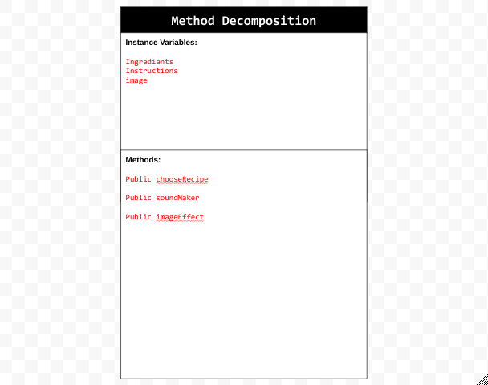
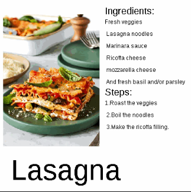

# Unit 7 - Creative Animation with The Theater Project

## Introduction

For this project, you will create an animation using The Theater that portrays a personal interest or solves a problem that you choose. Your program should demonstrate the object-oriented programming and software engineering skills and knowledge you have developed throughout the year.

## Requirements

Use your knowledge of object-oriented programming, data structures, and algorithms to create an animation using The Theater:

- **Use inheritance and polymorphism** – Create a superclass that represents shared attributes and behaviors with at least two subclasses that are more specific versions or variations of the superclass.
- **Method decomposition** – Use overloaded, overridden, and private methods to implement different versions of the same behavior, variations of a superclass behavior, and to improve code organization.
- **Use at least two data structures** - Use at least two 1D or 2D arrays or ArrayLists to store elements that are manipulated using loops and conditionals.
- **Implement one or more algorithms** – Implement one or more algorithms that use loops and two-way or multi-selection statements with compound Boolean expressions to analyze the data.
- **Create a visualization** – Create an animation that portrays a personal interest or solves a problem that you choose using objects, data structures, and methods.
- **Document your code** – Use comments to explain the purpose of the methods and code segments and note any preconditions and postconditions.

## Trello Board

[My Trello planning board](https://trello.com/b/TUs3weFS/unit-7-project-planning)

## UML Diagram

UML Diagram for my project

## Video

Thumbnail for my projethttps://youtu.be/z33Rj3HuHDQ

## Project Description

The personal interest this project addresses is dinner recipes. If a user would want to find a good recipe to make, they could use the app to select which recipe they would like to make and then get that recipe. The user story was for a TikTok user who likes to watch videos about cooking to learn more about new recipes and what they will make for their next meal. This project addresses this issue.